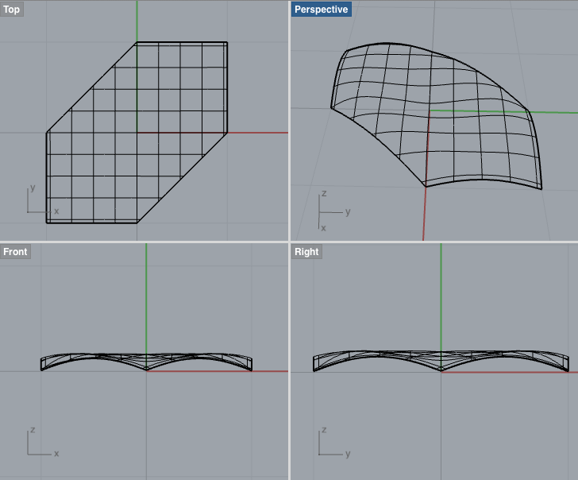
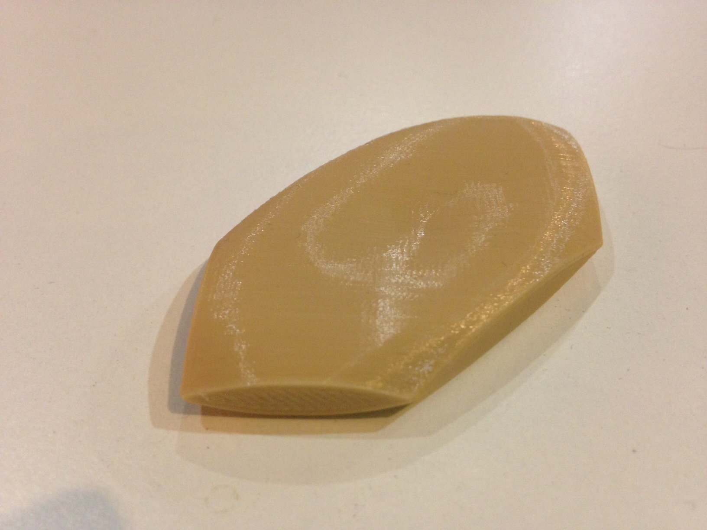

CC Spheres
==========

This is a script that is meant to be run by the CAD program Rhino. It will generate a special mathematical curve, the spheres of radius 1,2,3 in the Carnot-Carathéodory metric on the real Heisenberg group induced by a hexagonal norm.

## Reason

I worked on this script in order to generate CAD models of CC spheres of different radii such that I could 3D print examples for [Moon Duchin](http://mduchin.math.tufts.edu/), a mathematics professor at Tufts University. Moon explained to me the mathematics behind the shapes and gave me the surface attributes that allowed me to generate the surfaces in Rhino. I explain the mathematics behind the shapes on my blog [here](https://katygero.wordpress.com/2015/01/10/cc-spheres-explained-i-e-math/) and a little bit about the printing process [here](https://katygero.wordpress.com/2015/01/07/printing-cc-spheres/).

## Result

Below is a screenshot from Rhino of the resulting surface. It must be reflected across the x-y plane to represent a full sphere. 

And here is a picture of a resulting 3D-printed sphere.

